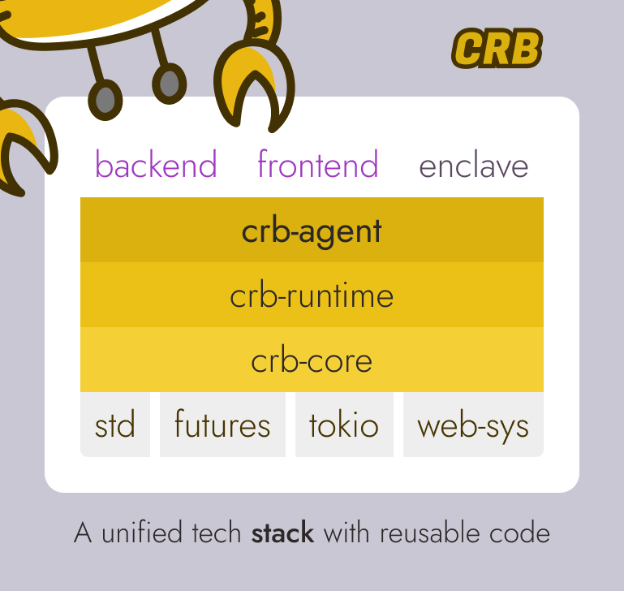

# CRB | Composable Runtime Blocks

[![Crates.io][crates-badge]][crates-url]
[![MIT licensed][mit-badge]][mit-url]
[![Documentation][docs-badge]][docs-url]

[crates-badge]: https://img.shields.io/crates/v/crb.svg
[crates-url]: https://crates.io/crates/crb
[mit-badge]: https://img.shields.io/badge/license-MIT-blue.svg
[mit-url]: https://github.com/runtime-blocks/crb/blob/master/LICENSE
[docs-badge]: https://docs.rs/crb/badge.svg
[docs-url]: https://docs.rs/crb

A unique framework that implementes **hybrid workloads**, seamlessly combining synchronous and asynchronous activities, state machines, routines, the actor model, and supervisors.

It’s perfect for building massive applications and serves as an ideal low-level framework for creating your own frameworks, for example AI-agents.
The core idea is to ensure all blocks are highly compatible with each other, enabling significant code reuse.

# What is a hybrid workload?

A hybrid workload is a concurrent task capable of switching roles - it can function as a synchronous or asynchronous task, a finite state machine, or as an actor exchanging messages.

The key feature is its ability to combine these roles, enabling the implementation of algorithms with complex branching that would be impossible in the flat structure of a standard function. This makes it ideal for building the framework of large-scale applications or implementing complex workflows, such as AI pipelines.

[picutre]

The implementation is designed as a fully portable solution that can run in a standard environment, a WASM virtual machine (e.g., in a browser), or a TEE enclave. This approach significantly reduces development costs by allowing you to reuse code across all parts of your application: backend, frontend, agents, and more.



# Examples

Code examples are simplified! Imports like `async_trait` macro, and `anyhow::Result` are not presented in the examples.

Also all the agents require `Context` and `Output` parameter that provides advanced features to extend agents behaviour and gather results, but that examples are not presented here.

## Single-state single-run `async` task

```rust
pub struct Task;

impl Agent for Task {
    fn begin(&mut self) -> Next<Self> {
        Next::do_async(())
    }
}

impl DoAsync for Task {
    async fn once(&mut self, _: &mut ()) -> Result<Next<Self>> {
        reqwest::get("https://www.rust-lang.org").await?.text().await?;
        Ok(Next::done())
    }
}
```

## Multi-state single-run `async` than `sync` task

```rust
pub struct Task;

impl Agent for Task {
    fn begin(&mut self) -> Next<Self> {
        let url = "https://www.rust-lang.org".into();
        Next::do_async(GetPage { url })
    }
}

struct GetPage { url: String }

impl DoAsync<GetPage> for Task {
    async fn once(&mut self, state: &mut GetPage) -> Result<Next<Self>> {
        let text = reqwest::get(state.url).await?.text().await?;
        Ok(Next::do_sync(Print { text }))
    }
}

struct Print { text: String }

impl DoSync<Print> for Task {
    fn once(&mut self, state: &mut Print) -> Result<Next<Self>> {
        printlnt!("{}", state.text);
        Ok(Next::done())
    }
}
```

## Repetetive async task

```rust
pub struct Task;

impl Agent for Task {
    fn begin(&mut self) -> Next<Self> {
        Next::do_async(Monitor)
    }
}

struct Monitor {
    total: u64,
    success: u64,
}

impl DoAsync<Monitor> for Task {
    async fn repeat(&mut self, mut state: &mut Monitor) -> Result<Option<Next<Self>>> {
        state.total += 1;
        reqwest::get("https://www.rust-lang.org").await?.error_for_status()?;
        state.success += 1;
        sleep(Duration::from_secs(10)).await;
        Ok(None)
    }
}
```

## Concurrent Task

```rust
pub struct ConcurrentTask;

impl Agent for ConcurrentTask {
    fn begin(&mut self) -> Next<Self> {
        Next::do_async(())
    }
}

impl DoAsync for ConcurrentTask {
    async fn once(&mut self, _: &mut ()) -> Result<Next<Self>> {
        let urls = vec![
            "https://www.rust-lang.org",
            "https://www.crates.io",
            "https://crateful.substack.com",
            "https://knowledge.dev",
        ];
        let futures = urls.into_iter().map(|url| reqwest::get(url));
        future::join_all(futures).await
        Ok(Next::done())
    }
}
```

## Parallel Task

```rust
pub struct ParallelTask;

impl Agent for ParallelTask {
    fn begin(&mut self) -> Next<Self> {
        Next::do_sync(())
    }
}

impl DoSync for ParallelTask {
    fn once(&mut self, _: &mut ()) -> Result<Next<Self>> {
        let numbers = vec![1, 2, 3, 4, 5, 6, 7, 8, 9, 10];
        let squares = numbers.into_par_iter().map(|n| n * n).collect();
        Ok(Next::done())
    }
}
```

## Task split

```rust
pub struct RunBoth;

impl Agent for RunBoth {
    fn begin(&mut self) -> Next<Self> {
        Next::do_async(())
    }
}

impl DoAsync for RunBoth {
    async fn once(&mut self, _: &mut ()) -> Result<Next<Self>> {
        join!(
            RunAgent::new(ConcurrentTask).run(),
            RunAgent::new(ParallelTask).run(),
        ).await;
        Ok(Next::done())
    }
}
```

## State Machine

```rust
pub struct Fsm;

impl Agent for Fsm {
    fn begin(&mut self) -> Next<Self> {
        Next::do_async(StateOne)
    }
}

struct StateOne;

impl DoAsync<StateOne> for Fsm {
    async fn once(&mut self, _: &mut StateOne) -> Result<Next<Self>> {
        Ok(Next::do_async(StateTwo))
    }
}

struct StateTwo;

impl DoAsync<StateTwo> for Fsm {
    async fn once(&mut self, _: &mut StateTwo) -> Result<Next<Self>> {
        Ok(Next::do_async(StateThree::default()))
    }
}

#[derive(Default)]
struct StateThree { counter: u64 }

impl DoAsync<StateThree> for Fsm {
    async fn once(&mut self, mut state: &mut StateThree) -> Result<Next<Self>> {
        state.counter += 1;
        Ok(Next::do_async(state))
    }
}
```

## Actor Model

```rust
struct Actor;

impl Agent for Actor {}

struct Download;

impl OnEvent<Download> for Actor {
    async handle(&mut self, event: Download, ctx: &mut Self::Context) -> Result<()> {
        todo!()
    }
}
```

## Interactions

```rust
struct Server {
    slab: Slab<Record>,
}

struct GetId;

impl Request for GetId {
    type Response = usize;
}

impl OnRequest<GetId> for Server {
    async on_request(&mut self, _: GetId, ctx: &mut Self::Context) -> Result<usize> {
        let record = Record { ... };
        Ok(self.slab.insert(record))
    }
}
```

```rust
struct Client {
    server: Address<Server>,
}

impl Agent for Client {
    fn begin(&mut self) -> Next<Self> {
        Next::in_context(Configure)
    }
}

struct Configure;

impl InContext<Configure> for Client {
    async fn once(&mut self, _: &mut Configure, ctx: &mut Self::Context) -> Result<Next<Self>> {
        self.server.request(GetId)?.forward(ctx)?;
        Ok(Next::process())
    }
}

impl OnResponse<GetId> for Client {
    async on_response(&mut self, id: usize, ctx: &mut Self::Context) -> Result<()> {
        println!("Reserved id: {id}");
        Ok(())
    }
}
```

## Fallbacks

```rust
impl InContext<Configure> for Client {
    async fn fallback(&mut self, err: Error) -> Next<Self> {
        println!("Server is not available :(");
        Next::do_async(TryAnotherServer)
    }
}
```

## Supervisor

Agents can launch and controls lifetime of child actors.

## Agent | Hybryd Actor

Agents can combine everything: actor mode and processing sync and async tasks.

## Pipelines

The crate contains an experimental implemntation of a `Pipeline` that will allow to build fully-automamted processing flows suitable for AI development cases.

## Compatibility

### Threads (`async+sync` tasks) support

```toml
[dependencies]
crb-agent = { version = "0.0.21", features = ["sync"] }
```

### WASM mode (`async` tasks only)

```toml
[dependencies]
crb-agent = { version = "0.0.21", default-features = false }
```

# Key Advantages

## WASM Compatibility

One of the library's major advantages is its out-of-the-box compatibility with WebAssembly (WASM). This allows you to write full-stack solutions in Rust while reusing the same codebase across different environments.

> Synchronous tasks are currently unavailable in WASM due to its lack of full thread support. However, using them in environments like browsers is generally unnecessary, as they block asynchronous operations.

## Actor Model

The library includes a complete implementation of the actor model, enabling you to build a hierarchy of actors and facilitate message passing between them. When the application stops, actors gracefully shut down between messages processing phases, and in the specified order.

## Synchronous Tasks

The framework supports not only asynchronous activities (IO-bound) but also allows running synchronous (CPU-bound) tasks using threads. The results of these tasks can seamlessly be consumed by asynchronous activities.

## Pipelines

The library offers a Pipeline implementation compatible with actors, routines, and tasks (including synchronous ones), making it ideal for building AI processing workflows.

## Trait-Based Design

Unlike many actor frameworks, this library relies heavily on traits. For example, tasks like interactive communication, message handling, or `Stream` processing are implemented through specific trait implementations.

More importantly, the library is designed to be extensible, allowing you to define your own traits for various needs while keeping your code modular and elegant. For instance, actor interruption is implemented on top of this model.

## Method Hierarchy

Trait methods are designed and implemented so that you only need to define specific methods to achieve the desired behavior.

Alternatively, you can fully override the behavior and method call order - for instance, customizing an actor’s behavior in any way you like or adding your own intermediate phases and methods.

## Error Handling and Resilience

The library provides built-in error handling features, such as managing failures during message processing, making it easier to write robust and resilient applications.

# Using the Library

## Adding a Dependency

Let's start with how to use the library. Although it consists of numerous crates with different types of blocks and foundational components, everything is unified under the main `crb` crate. To add it to your project, simply run:

```bash
cargo add crb
```

# Author

The project was originally created by [@therustmonk](https://github.com/therustmonk) as a result of extensive experimental research into implementing a hybrid actor model in Rust.

<a href="https://crateful.substack.com/" target="_blank"></a>

You can find more details in my blog, [Crateful](https://crateful.substack.com/). I also use this framework to produce and publish a free e-magazine of the same name about Rust crates, which leverages CRB agents to generate content.

# License

This project is licensed under the [MIT license].

[MIT license]: https://github.com/runtime-blocks/crb/blob/master/LICENSE
